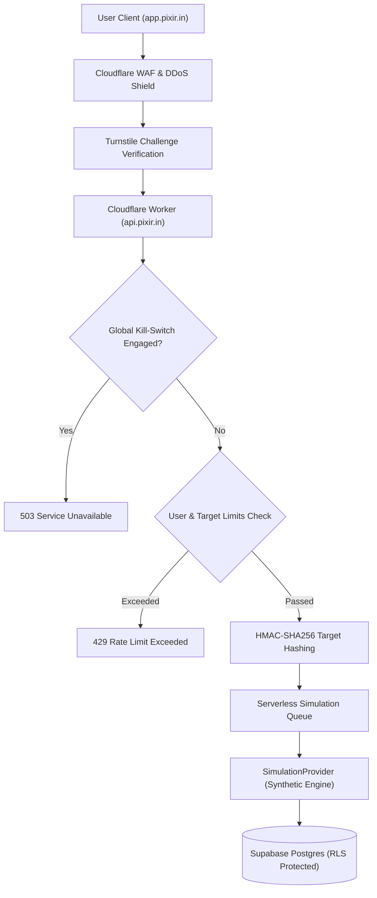

# TeleSim: Serverless Call & SMS Simulation Learning Platform

[](https://vitejs.dev/)
[](https://react.dev/)
[](https://workers.cloudflare.com/)
[](https://supabase.com/)
[](https://tailwindcss.com/)

A production-grade educational web application demonstrating modern serverless telecommunications architectures, Cloudflare Workers, Cloudflare Turnstile bot mitigation, and Supabase Row Level Security (RLS).

> **CRITICAL ETHICAL & SAFETY NOTICE:**  
> This platform **DOES NOT** flood, spam, harass, or contact real phone numbers. All voice calls and SMS packets remain inside an isolated synthetic `SimulationProvider` state machine. Target phone numbers act strictly as one-way HMAC cryptographic identifiers.

---

## 1. Project Overview

Telecommunications engineering involves high-concurrency event queues, asynchronous job processing, strict rate limiting, and zero-knowledge privacy. **TeleSim** provides developers with a complete, hands-on serverless environment to learn these systems without carrier abuse or real telecom costs.

### Key Capabilities
- **Modular Component Architecture:** Dedicated, self-contained components for Navbar, Hero, QuickCards, StatsCounter, ArchitectureServices, InteractiveSandboxLookup, EdgeMapSection, NewsScroller, ContactAbuseSection, and Footer.
- **Modern White & Green Theme:** Crisp neutral canvas, dark slate typography, emerald/mint highlights (`#10b981`), and soft ambient shadows.
- **Fully Responsive:** Optimized layouts for smartphones, tablets, and desktop workstations.
- **Mandatory Consent Flow:** First-time users must cryptographically accept the Responsible Use Framework before dispatching simulations.
- **Zero-Knowledge Privacy:** Target numbers are instantly converted to irreversible `HMAC-SHA256` digests; raw numbers are never stored in databases or server logs.
- **Server-Side Turnstile Verification:** Protects against bot automation, headless scripts, and credential stuffing.
- **Multi-Signal Abuse Scoring:** Dynamic risk assessment (Normal, Review, Restricted, Blocked) with an emergency Admin Kill-Switch.

---

## 2. Technology Stack

- **Frontend:** React 19, TypeScript, Vite, Tailwind CSS, React Router v7, Lucide React icons
- **Backend Edge:** Cloudflare Workers, TypeScript, REST APIs
- **Database & Auth:** Supabase PostgreSQL, Row Level Security (RLS), Google OAuth
- **Security & Bot Mitigation:** Cloudflare Turnstile, Cloudflare WAF, HMAC-SHA256 privacy hashing
- **Testing:** Vitest

---

## 3. Domain & Routing Structure

This application is architected to run isolated on dedicated subdomains without impacting existing pixir.in services:

- **Frontend Web Portal:** `https://app.pixir.in`
- **Serverless API Worker:** `https://api.pixir.in`

### Application Routes
| Route | Description |
|---|---|
| `/` | Landing page featuring modular hero, interactive sandbox lookup, PoP map, news scroller, and abuse desk |
| `/login` | Google OAuth authentication gateway with role switching (Learner vs Admin) |
| `/dashboard` | Main telemetry center: remaining rate limits, simulation credits, active jobs |
| `/simulate` | Simulation dispatch form with Turnstile challenge, count bounds, and safety notices |
| `/simulations` | Historical simulation ledger with search and status filters |
| `/simulations/:id` | Visual telecom pipeline tracker (Created -> Ringing -> Connected -> Completed) |
| `/account` | User sovereignty desk: GDPR JSON export, delete account, consent record inspection |
| `/report-abuse` | Public incident reporting form for suspicious simulation identifiers |
| `/admin` | SecOps command center: Emergency Kill-Switch, maintenance mode, abuse queue, audit trail |
| `/terms` | Platform Terms & Conditions (Version 1.0) |
| `/privacy` | Privacy Policy detailing zero-raw-storage and HMAC hashing |
| `/acceptable-use` | Strict Anti-Harassment & Anti-Flooding Framework |

---

## 4. Database Schema & Migrations

Database tables and Row Level Security policies are organized inside `supabase/migrations/`:

```
supabase/
├── migrations/
│   ├── 001_initial_schema.sql    # users, consents, simulation_jobs, step_logs
│   ├── 002_rls.sql               # Row Level Security & is_admin() function
│   ├── 003_indexes.sql           # Indexes for fast rate-limiting queries
│   ├── 004_audit_logs.sql        # audit_logs and abuse_reports with RLS
│   └── 005_system_config.sql     # system_config & emergency killswitch
└── seed/
    └── seed.sql                  # Initial seed data for admin and test learner
```

---

## 5. Security Architecture & Anti-Abuse Controls



1. **Per-User Rate Limit:** Maximum 5 simulation jobs per hour.
2. **Per-Target Rate Limit:** Maximum 3 simulation events per 24 hours for the same target hash.
3. **Global Rate Limit:** Maximum 30 jobs per minute across the platform.
4. **Concurrent Job Prevention:** Maximum 1 active job per user.
5. **Mandatory Cooldown:** Minimum 15-second cooldown period between job dispatches.
6. **Emergency Circuit Breaker:** Admin toggle disables simulator globally, immediately returning HTTP 503.

---

## 6. Local Development Setup

### Prerequisites
- Node.js >= 18.0.0
- npm >= 9.0.0

### Step-by-Step Installation

```bash
# 1. Clone repository
git clone https://github.com/pixir-org/serverless-telecom-simulation.git
cd serverless-telecom-simulation

# 2. Install dependencies
npm install

# 3. Setup environment variables
cp .env.example .env

# 4. Start local development server
npm run dev

# 5. Run automated tests
npm run test

# 6. Typecheck TypeScript
npm run typecheck
```

---

## 7. Cloudflare Deployment

### 1. Cloudflare Pages (Frontend)
Build the frontend bundle:
```bash
npm run build
```
Deploy the `dist/` folder to Cloudflare Pages mapped to `app.pixir.in`.

### 2. Cloudflare Workers (Backend)
Set production secrets via Wrangler:
```bash
npx wrangler secret put SUPABASE_URL
npx wrangler secret put SUPABASE_SERVICE_ROLE_KEY
npx wrangler secret put TURNSTILE_SECRET_KEY
npx wrangler secret put TARGET_HASH_SECRET
npx wrangler secret put ADMIN_SECRET
```
Deploy the worker:
```bash
npx wrangler deploy
```

---

## 8. Responsible Use & License

This project is licensed under the MIT License for educational and research purposes.  
Review the [Acceptable Use Policy](file:///c:/Users/SUDHANSHU/Downloads/Fun/src/pages/AcceptableUsePage.tsx) prior to deploying in production environments.